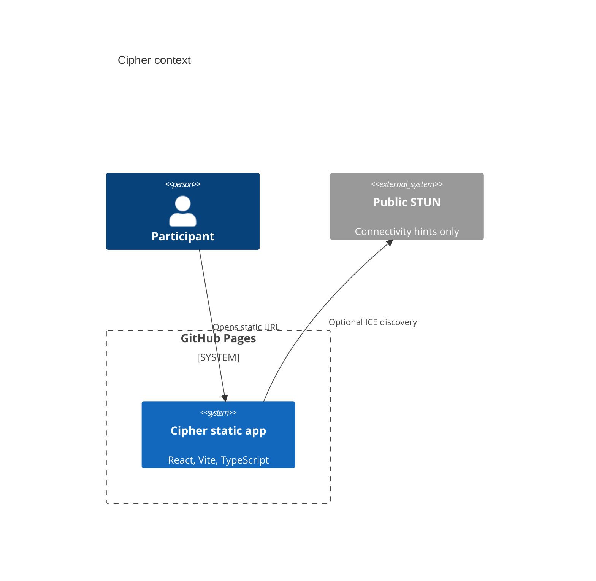

# Cipher

[Live Pages URL](https://baditaflorin.github.io/cipher/) · [Repository](https://github.com/baditaflorin/cipher) · [Support](https://www.paypal.com/paypalme/florinbadita)

Static, browser-only encrypted group chat with MLS membership, WebRTC mesh, local summaries, and no server-held group state.

Cipher is for sensitive coordination where a hosted chat service is the wrong trust boundary. Open the static URL, generate local keys, share one-time invite capsules, and sync encrypted Yjs state over browser-to-browser channels.

## Quickstart

```bash
npm install
make install-hooks
make dev
make test
make build
```

## Live Site

https://baditaflorin.github.io/cipher/

The page shows the current app version and git commit in the header.

## What Works In v0.1.0

- Browser-generated libsodium identity keys stored in IndexedDB.
- One-time invite links containing host public identity and pre-key material.
- Join request and welcome capsules encrypted with libsodium sealed boxes.
- RFC 9420 MLS membership operations via `ts-mls`, with a self-test in the app and unit tests.
- Encrypted Yjs message log persisted locally and synced through BroadcastChannel or manual WebRTC signal capsules.
- Local summarization and Whisper transcription adapters through Transformers.js, loaded only after user action.
- GitHub and PayPal links in the live UI.

## Architecture



More detail: `docs/architecture.md`

## Commands

```bash
make dev
make build
make test
make smoke
make pages-preview
```

## Documentation

- `docs/adr/0001-deployment-mode.md`
- `docs/architecture.md`
- `docs/deploy.md`
- `docs/privacy.md`
- `docs/postmortem.md`

## Security

This is experimental v0.1.0 software and has not been independently audited. Do not publish real invite capsules or private keys. See `SECURITY.md`.
